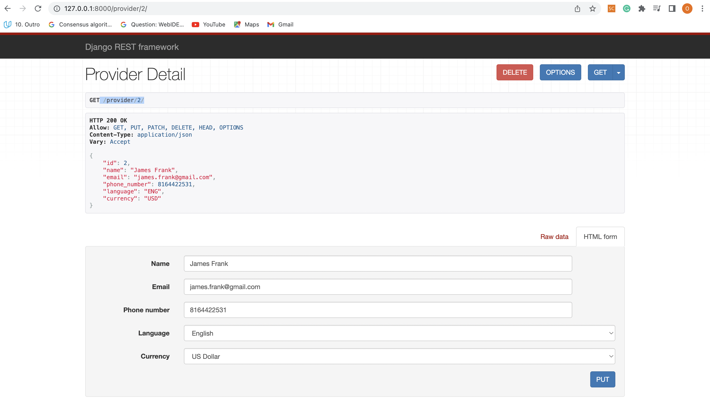
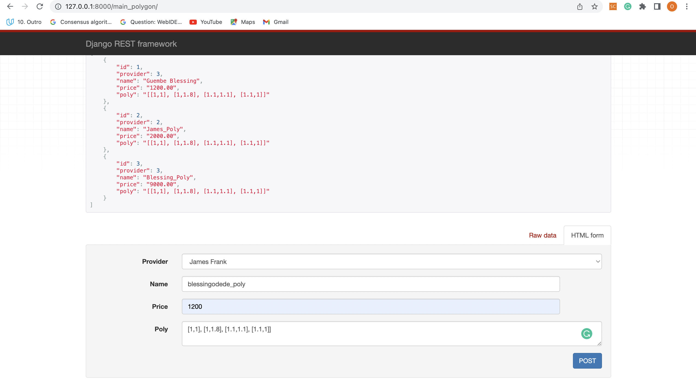
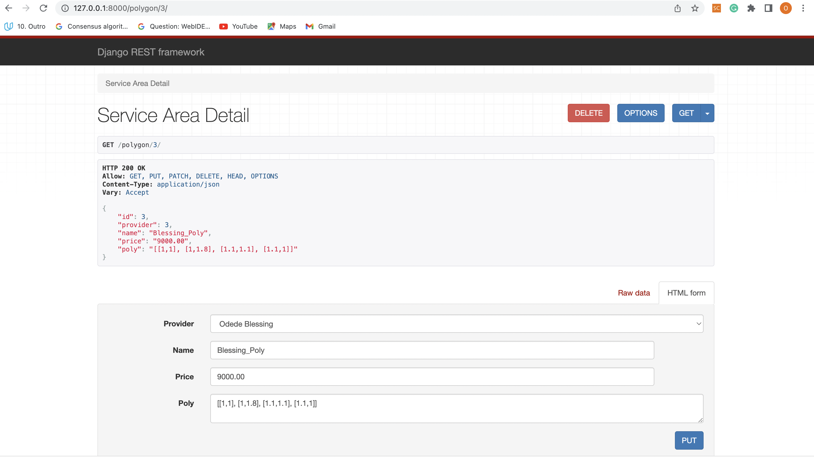

# Mozio-Interview API

*API PROJECT:*

*Author: Guembe Blessing*

*Objectives:*

- Recruitment Test to Demostrate Python Django Framework Skillset*

- Implement Readable API docs & Test Cases*

*Prompt:*

As Mozio expands internationally, we have a growing problem that many transportation suppliers we'd like to integrate cannot give us concrete zip codes, cities, etc that they serve.

To combat this, we'd like to be able to define custom polygons as their "service area" and we'd like for the owners of these shuttle companies to be able to define and alter their polygons whenever they want, eliminating the need for mozio employees to do this boring grunt work.

*Requirements:*

- Build a JSON REST API with CRUD operations for Provider (name, email, phone number, language and currency) and ServiceArea (name, price, geojson information)

- Create a specific endpoint that takes a lat/lng pair as arguments and return a list of all polygons that include the given lat/lng. The name of the polygon, provider's name, and price should be returned for each polygon. This operation should be FAST.

- Use unit tests to test your API;

- Write up some API docs (using any tool you see fit);

- Create a Github account (if you don’t have one), push all your code and share the link with us;

- Deploy your code to a hosting service of your choice. Mozio is built entirely on AWS, so bonus points will be awarded for use of AWS.

*Implementation Requirements:*

Include:

 - Django
 - SqLite3
 

Requirements:

 - Python >= 3.8
 
## API ##

*Create Provider:*

- Create New Transportation Provider `http://127.0.0.1:8000/main_provider/`

- The body of the POST request will contain the following fields:  `{Name, Email, Phone Number, Language, Currency}`

*Retrieve Provider:*

- Retrieve Transportation Providers `GET http://127.0.0.1:8000/provider/2/`

*Update Provider:*

- Update Transportation Provider in the Body of the POST Request using the Primary Key of the Provider `PUT /provider/2/`

*Create Service Provider:*

-  Create a New Service Provider Area `http://127.0.0.1:8000/main_polygon/` 

 *Retrieve Service Provider:*

- Retrieve Service Area Providers `GET http://127.0.0.1:8000/polygon/2/`

 *Update Service Provider:*

-  Update Service Area Providers `GET http://127.0.0.1:8000/polygon/3/`

-  Body of the POST Request contains the following fields for Updating the Service Area Provider: `{Provider, Name, Price, Poly}`

*Query Polygons:*

- Retrieve Polygos `http://127.0.0.1:8000/query/?lat=0.40&lng=0.40`

- The Query Parameters Contains the Latitude (lat) and Longitude (lng)

