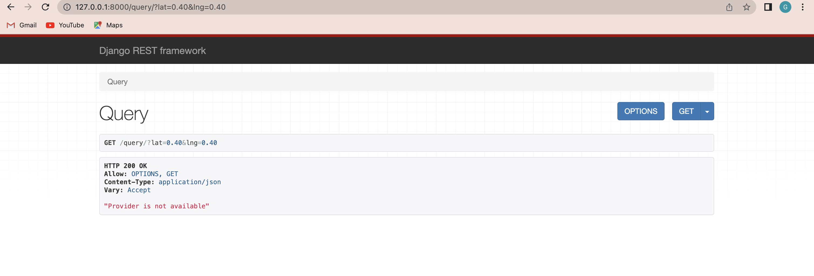

# Transportation API
*API PROJECT:*

*Author: Guembe Blessing*

*Objectives:*

*Implementation Requirements:*

Include:

 - Django
 - SqLite3
 

Requirements:

 - Python >= 3.8
 
## API ##

*Create Provider:*

- Create New Transportation Provider `http://127.0.0.1:8000/main_provider/`

- The body of the POST request will contain the following fields:  `{Name, Email, Phone Number, Language, Currency}`

*Retrieve Provider:*

- Retrieve Transportation Providers `GET http://127.0.0.1:8000/provider/2/`

*Update Provider:*

- Update Transportation Provider in the Body of the POST Request using the Primary Key of the Provider `PUT /provider/2/`

*Create Service Provider:*

-  Create a New Service Provider Area `http://127.0.0.1:8000/main_polygon/` 

 *Retrieve Service Provider:*

- Retrieve Service Area Providers `GET http://127.0.0.1:8000/polygon/2/`

 *Update Service Provider:*

-  Update Service Area Providers `GET http://127.0.0.1:8000/polygon/3/`

-  Body of the POST Request contains the following fields for Updating the Service Area Provider: `{Provider, Name, Price, Poly}`

*Query Polygons:*

- Retrieve Polygos `http://127.0.0.1:8000/query/?lat=0.40&lng=0.40`

- The Query Parameters Contains the Latitude (lat) and Longitude (lng)

